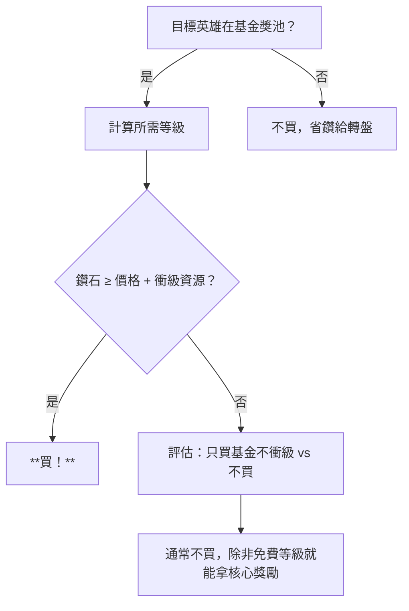

# 英雄升星基金 攻略指南（2025-09-07 ~ 10-04）

> **活動週期**：單期長期活動  
> **日期**：09/07 UTC 00:00 – 10/04 UTC 24:00（28 天）  
> **類別**：超值活動 💎 **全月貫穿**  
> **並行活動**：英雄集結①（09/07–09/20）、英雄集結②（09/21–10/04）

---

## 🎯 活動機制核心

| 項目 | 說明 |
|------|------|
| **購買價格** | 通常 4,800~9,800 鑽石（視版本） |
| **核心獎勵** | 指定英雄碎片大量、通用碎片、轉盤幣、資源箱、加速 |
| **升級方式** | 完成每日/每周任務得經驗 → 等級提升 → 解鎖獎勵 |
| **最高等級** | 通常 30~50 級 |
| **性價比** | **極高**（折合碎片價格通常 < 商店直購 3~5 折） |

---

## 💰 買不買決策樹（09/07 當天決定）



### 快速試算表（範例數值，請對照實際介面）

| 目標 | 所需基金等級 | 所需任務積分 | 預估每日需花費 | 總鑽石成本（基金+補資源） |
|------|--------------|--------------|----------------|---------------------------|
| 目標英雄 5★→6★ (需 50 碎片) | Lv. 25 | ~12,500 | ~450 積分/天 | 基金價 + 0~2,000 鑽 |
| 目標英雄 0★→5★ (需 250 碎片) | Lv. 45 | ~45,000 | ~1,600 積分/天 | 基金價 + 5,000~15,000 鑽 |

> **經驗法則**：若你**日常任務都做**，通常免費能達 Lv.20~25；要衝更高需**補體力/加速/購買任務道具**。

---

## 📅 28 天每日/每週節奏

| 週期 | 日期範圍 | 重點 | 衝突活動 |
|------|----------|------|----------|
| **W1** | 09/07–09/13 | **買基金、確認目標、每日任務全做** | 無重大衝突 |
| **W2** | 09/14–09/20 | **四大活動同週**，基金任務按部就班 | 聯盟爭霸戰①、聖劍、聯盟總動員、馴獸師 |
| **W3** | 09/21–09/27 | **最強領主核心週**，基金任務**只做免費/低成本** | 最強領主、聯盟爭霸戰②、英雄集結② |
| **W4** | 09/28–10/04 | **收尾衝等級**，清空獎勵、兌換商店 | 英雄集結②結束 |

---

## 🔄 三活動聯動資源分配表

| 資源 | 英雄集結① | 英雄升星基金 | 英雄集結② | 最強領主 | 分配建議 |
|------|-----------|--------------|-----------|----------|----------|
| **鑽石** | 買轉盤幣 | **買基金** | 買轉盤幣 | Day 2 轉盤 | **基金 > 最強領主轉盤 > 集結轉盤** |
| **傳說/史詩/稀有信物** | 升星目標英雄 | 基金給碎片轉信物 | 升星目標英雄 | **Day 2 必用** | **最強領主 Day 2 優先**，剩餘給集結 |
| **轉盤幣/幸運幣** | 抽目標英雄 | 基金給幣 | 抽目標英雄 | **Day 2 120抽** | **最強領主 Day 2 鎖 120 抽**，餘給集結 |
| **體力/行動力** | 掃圖拿碎片 | 基金任務需體力 | 掃圖拿碎片 | Day 4 巨獸/野獸 | **最強領主 Day 4 優先**，餘力做基金任務 |
| **加速道具** | 完成任務 | 基金任務需加速 | 完成任務 | **Day 3/7 核心** | **最強領主 Day 3/7 全留**，基金只用免費得的 |

---

## 🎁 必拿獎勵清單（按優先級）

| 優先級 | 獎勵 | 所需等級 | 備註 |
|--------|------|----------|------|
| 🔴 **Must** | 目標英雄碎片（大量） | 依目標 | 核心收益 |
| 🔴 **Must** | 英雄轉盤幣/幸運幣 | 全程 | 餵最強領主 Day 2 |
| 🟡 **Should** | 通用英雄碎片 | 中高等級 | 補非目標英雄 |
| 🟡 **Should** | 加速道具（建造/研究/訓練） | 中等級 | 餵最強領主 Day 1/3/7 |
| 🟢 **Nice** | 資源箱（糧/木/石/鐵） | 低等級 | 補日常 |
| 🟢 **Nice** | 聯盟戰令/體力藥水 | 雜項 | 補聯盟活動 |

---

## ⚠️ 避坑指南

1. **不要為了基金任務額外買體力/加速**（除非差 1 級拿核心獎勵）
2. **基金經驗任務與最強領主任務重疊時**，以最強領主為準（分數高得多）
3. **英雄集結②（09/21 開啟）獎池可能更新新世代英雄** → 基金若給舊世代，優先級下調
4. **最後 3 天（10/02–10/04）衝等級**，別錯過結算

---

## ✅ 每日 00:05 檢查清單

```text
[英雄升星基金 Day X / 28]
1. 當前等級：___ / 目標等級：___
2. 今日免費任務經驗：___ / 總需：___
3. 核心獎勵進度：目標英雄碎片 ___/___
4. 轉盤幣獲得：今日 ___ / 累計 ___
5. 是否需補資源衝級？ 是/否 → 成本 ___ 鑽
6. 最強領主本週需求：___________________（優先）
```

---

## 檔案元資料
- 建立時間：2025-09-XX
- 最後更新：2025-09-XX（待實際機制/價格確認後細化）
- 維護者：Evelyn 🦊 / Wilson
- 版本：v1.0 模板版